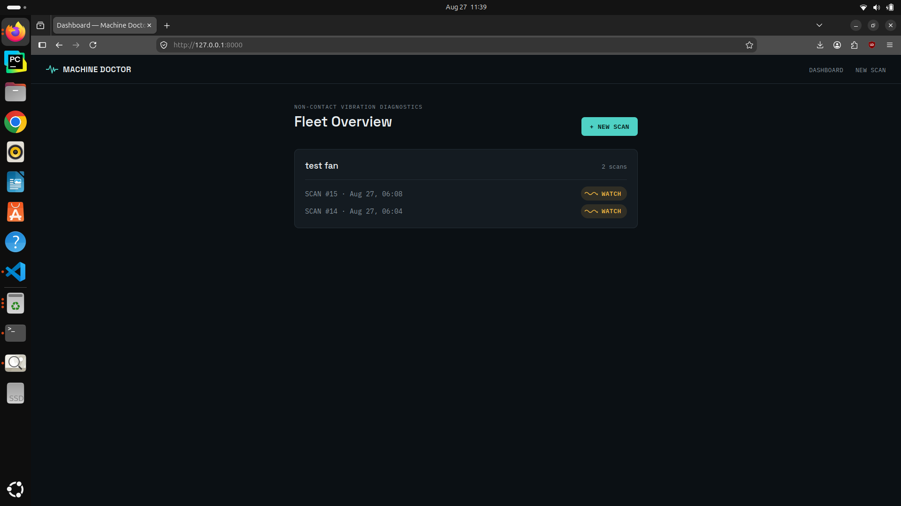
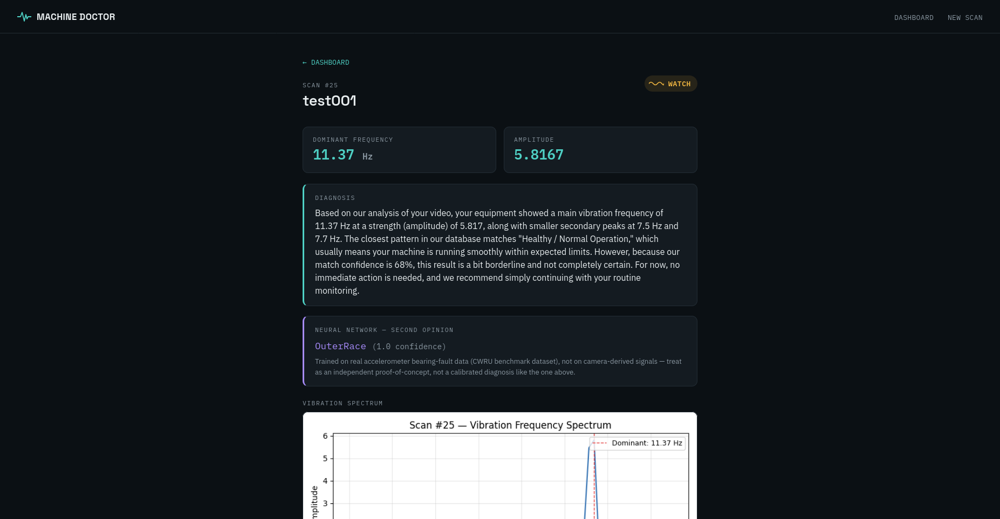
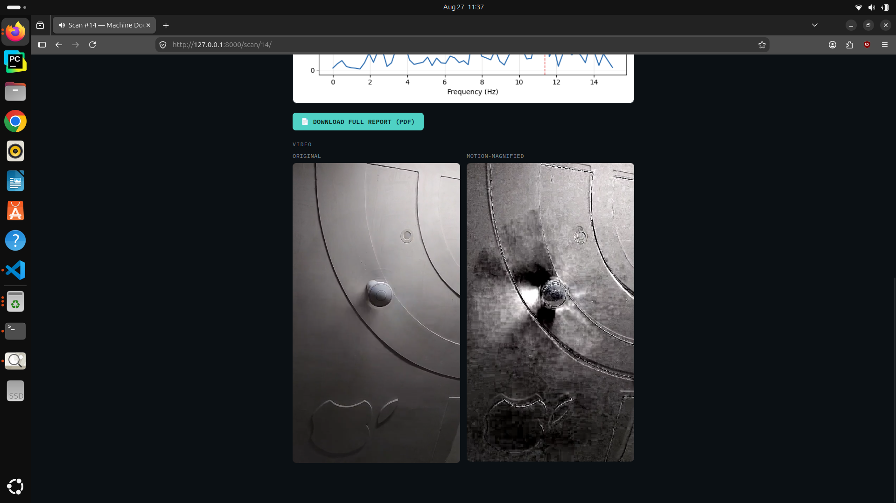
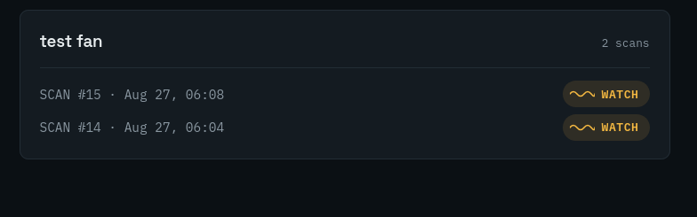
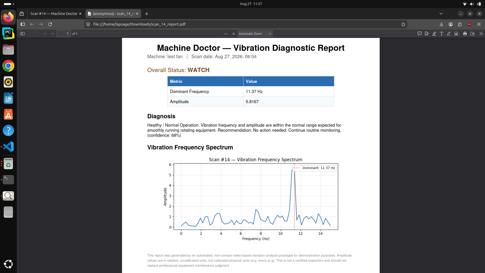
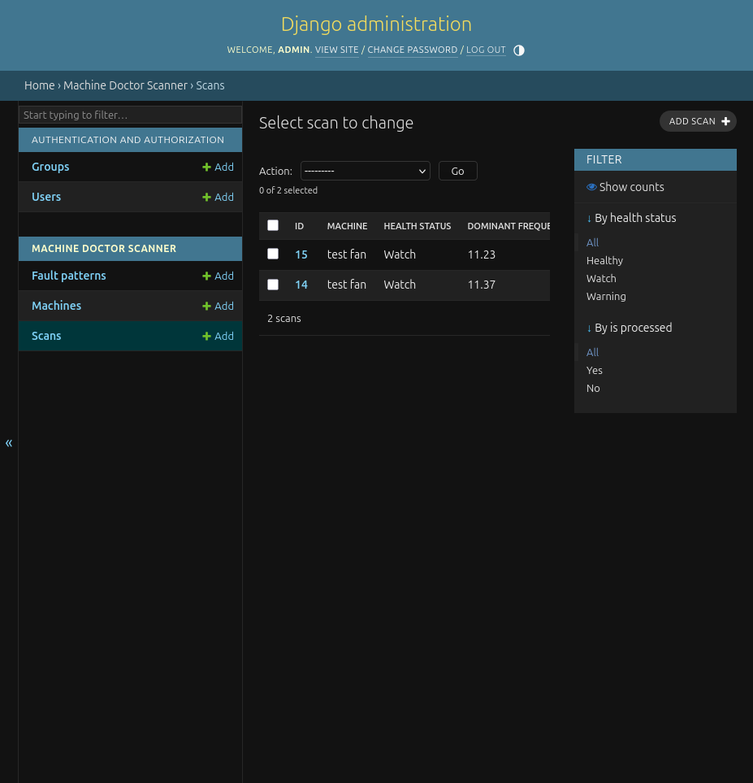
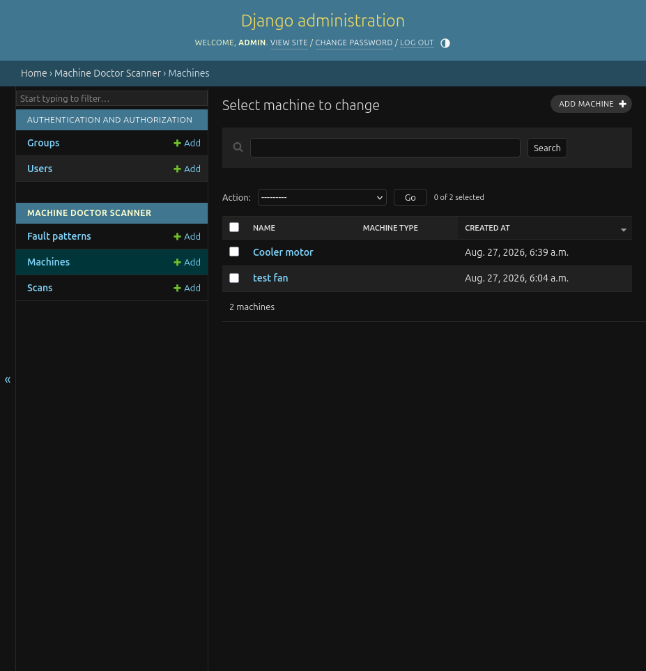
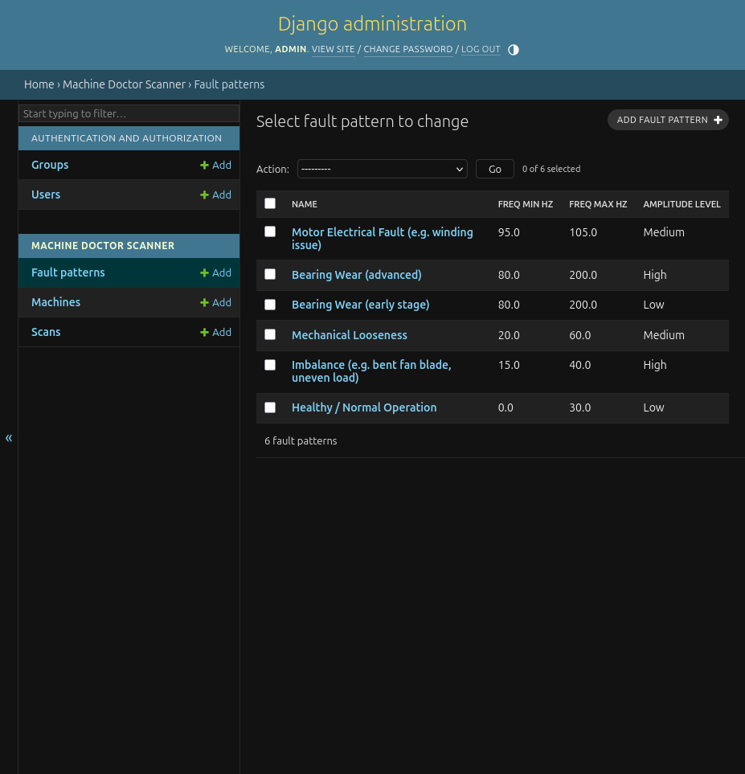

# Machine Doctor — Non-Contact Vibration Diagnostics

Detects machine vibration/health issues from an ordinary video — no physical
sensors required. Upload or record a short clip of a fan, motor, or other
rotating equipment; the app magnifies vibrations invisible to the naked eye,
filters out camera-shake noise, extracts the true vibration frequency, and
returns a plain-English diagnosis with a downloadable PDF report.

Built as a CPU-only prototype (Intel i7, no GPU) for a non-contact 3D
vibration imaging / predictive maintenance internship application.

## Demo

[](https://www.youtube.com/watch?v=XyHd_Qf5A2Q)


## Screenshots

<table>

<tr>

<td></td>

<td></td>

<td></td>

</tr>

<tr>

<td align="center"><b>Fleet Dashboard</b></td>

<td align="center"><b>Scan Result & Diagnosis</b></td>

<td align="center"><b>Motion-Magnified Video</b></td>

</tr>

<tr>

<td></td>

<td></td>

</tr>

<tr>

<td align="center"><b>Trend History</b></td>

<td align="center"><b>PDF Report</b></td>

</tr>

<tr>

<td></td>

<td></td>

<td></td>

</tr>

<tr>

<td align="center"><b>Django Admin — Scans</b></td>

<td align="center"><b>Django Admin — Machines</b></td>

<td align="center"><b>Django Admin — Machine Patterns</b></td>

</tr>

</table>

## What it does

1. **Upload or record** a 5-15 second video of a machine (file upload or live webcam)
2. **Ego-motion filtering** — separates your hand-shake from the machine's real vibration using optical flow + RANSAC
3. **Motion magnification** — exaggerates sub-pixel vibration so it's visible in the output video
4. **FFT vibration analysis** — extracts the dominant frequency and amplitude
5. **3D spatial registration** — lightweight two-view depth estimation (Essential matrix + triangulation)
6. **AI diagnosis (RAG)** — retrieves the closest matching fault pattern via embedding similarity, then a real LLM (Gemini) generates a grounded, natural-language diagnosis
7. **History + trend prediction** — compares recent scans per machine, flags a worsening trend before it becomes a failure
8. **PDF report** — downloadable report with chart, diagnosis, and key metrics
9. **Neural network second opinion** — a 1D CNN trained on the real CWRU bearing-fault benchmark dataset provides an independent classification alongside the RAG diagnosis

## Tech stack

- **Backend:** Django 5, SQLite
- **Vision/Signal processing:** OpenCV (optical flow, RANSAC pose estimation), NumPy, SciPy (FFT, filtering)
- **AI diagnosis:** `sentence-transformers` (embedding retrieval) + Google Gemini API (generation)
- **Deep learning:** PyTorch — 1D CNN trained on real accelerometer data (CWRU dataset), trained on Google Colab (GPU)
- **Video encoding:** `imageio` + `imageio-ffmpeg` (H.264 output, browser-playable)
- **Charts:** Matplotlib
- **PDF reports:** ReportLab
- **Frontend:** Django templates, vanilla JS (webcam recording via `MediaRecorder`)

## Setup

```bash
git clone https://github.com/saga1206/machine-doctor-vibration-diagnostics.git
cd machine-doctor-vibration-diagnostics

python3 -m venv venv
source venv/bin/activate        # Windows: venv\Scripts\activate

pip install -r requirements.txt

# CPU-only PyTorch (much smaller download than the default GPU build):
pip install torch --index-url https://download.pytorch.org/whl/cpu

# Place your trained model (see "Deep learning" section below for how
# it's trained) at:
#   scanner/analysis/models/vibration_cnn_final.pt

# Optional but recommended: real AI-generated diagnosis text.
# Get a free key at https://aistudio.google.com/app/apikey
export GEMINI_API_KEY="your-key-here"

python manage.py makemigrations
python manage.py migrate
python manage.py seed_fault_patterns
python manage.py createsuperuser

python manage.py runserver
```

Open `http://127.0.0.1:8000/`. Without `GEMINI_API_KEY` set, diagnosis text
falls back automatically to template-based text — the app still fully works,
just without natural-language generation.

## Project structure

```
scanner/
├── models.py                  # Machine, Scan, FaultPattern
├── views.py                   # dashboard, upload, scan_result, machine_detail
├── forms.py
├── analysis/                  # the actual vibration-diagnostics pipeline
│   ├── ego_motion_filter.py   # camera-shake vs. real vibration separation
│   ├── motion_magnify.py      # Eulerian-style motion magnification
│   ├── vibration_fft.py       # frequency/amplitude extraction
│   ├── spatial_3d.py          # two-view Structure-from-Motion
│   ├── diagnosis_rag.py       # embedding-based retrieval
│   ├── generation.py          # LLM-based diagnosis generation (Gemini)
│   ├── neural_diagnosis.py    # trained CNN inference (second opinion)
│   ├── trend_prediction.py    # history/trend analysis
│   ├── report_pdf.py          # PDF report generation
│   ├── pipeline.py            # orchestrates all of the above
│   └── models/vibration_cnn_final.pt  # trained model weights (not in git -- see Setup)
├── templates/scanner/
└── management/commands/seed_fault_patterns.py
fault_knowledge_base.json      # reference fault-pattern knowledge base
deep_learning/                 # Colab notebooks used to train the CNN (see below)
```

## Deep learning: neural network second opinion

In addition to the RAG-based diagnosis, a **1D Convolutional Neural Network** is trained separately (in Colab, using a free GPU) on the [CWRU Bearing Data Center dataset](https://engineering.case.edu/bearingdatacenter) — real accelerometer recordings from an actual motor test rig, not synthetic data. It classifies 4 fault types: Normal, Ball fault, Inner Race fault, Outer Race fault.

**Why not just trust the first accuracy number:** an initial run using a file-based train/test split hit ~100% test accuracy with unstable loss swings between epochs — a red flag for the well-documented *condition leakage* issue in this dataset (files at the same load can share recording-session artifacts unrelated to the actual fault). This was caught and fixed with **leave-one-load-out cross-validation**: training on 3 of the 4 load conditions and testing only on the load the model never saw at all, repeated once per load so every window gets a genuinely out-of-condition prediction.

**Result:** 99.9% pooled accuracy across all four held-out-load folds, with the small number of real misclassifications occurring between physically adjacent fault locations (e.g. OuterRace↔InnerRace) rather than randomly — evidence of learning real fault signatures, not memorizing recording artifacts.

**Training pipeline (Colab notebooks in `deep_learning/`):**
1. Download & explore the dataset, visually confirm healthy vs. faulty signals differ
2. Preprocess into 1024-sample windows, split by file to prevent window-level leakage
3. Build the CNN architecture, sanity-check output shapes before training
4. Train with class-weighted loss (the dataset is imbalanced — far more fault recordings than healthy ones)
5. **Leave-one-load-out validation** to rule out condition leakage (see above)
6. Train the final deployment model on 100% of available data, export as a single `.pt` file

**Important honesty note:** the CNN was trained on accelerometer data at 12,000 samples/second, measuring acceleration directly. The camera pipeline (steps 1-8 above) produces a motion signal at ~30 frames/second, measuring pixel displacement — a different physical quantity at a very different sampling rate. The app resamples and feeds the camera signal into this model as a genuine, working deep-learning component, but its accuracy on camera-derived signals specifically has not been validated the way it was validated on real accelerometer data. It's shown in the UI as a clearly labeled, separate **second opinion**, not blended into the primary diagnosis — the two are expected to sometimes disagree, and that's the honest behavior, not a bug.

## Known limitations (by design, not oversights)

- **Amplitude is in relative, uncalibrated units** (pixel-motion), not physical units like mm/s or g. A production system would calibrate this using camera-to-subject distance and a standard like ISO 10816.
- **Frequency ceiling = half the camera's frame rate** (Nyquist limit). A 30fps camera can never reliably detect vibration faster than ~15 Hz — a fundamental limitation of any camera-based approach, not a bug.
- **3D depth needs camera movement.** A perfectly steady tripod shot (ideal for vibration measurement) gives zero parallax for depth estimation. The pipeline automatically tries several frame-gaps and degrades gracefully (marks depth as "unavailable" rather than failing the whole scan) if the footage is too steady.
- **Monocular depth has no absolute scale.** Two cameras (stereo) or a known reference object would be needed to know real-world distances, not just relative depth ordering.
- **Diagnosis is RAG-based, not a trained classifier** — it retrieves the closest matching entry from a small hand-authored knowledge base (6 fault patterns) via embedding similarity, then an LLM writes up the explanation. It's only as good as that knowledge base's coverage.

## License

Personal/educational project — no license specified.